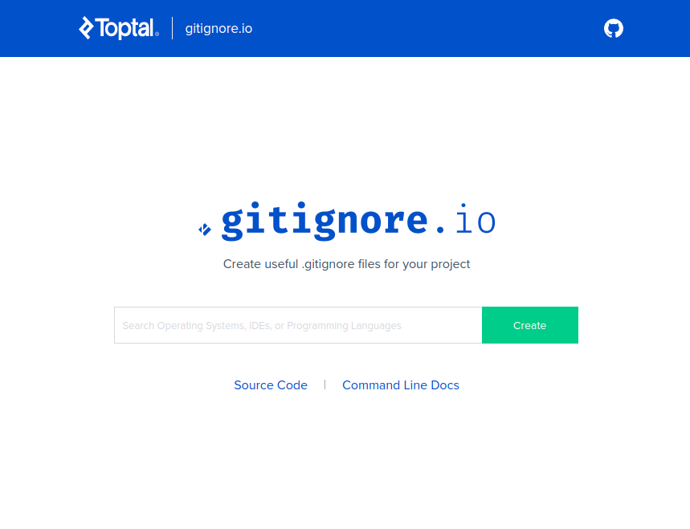

# creare .gitignore base con gitignore.io

Il modo piu' semplice per creare il file gitignore e' utilizzare il sito [gitignore.io](https://www.toptal.com/developers/gitignore), lo uso sempre da quando l'ho scoperto.

Utilizzarlo e' semplicissimo basta listare tutti gli ambienti, strumenti e linguaggi utilizzati nell'unico campo input presente, click sul button e il file verra' generato immediatamente.

# Edit del file generato
Tra i commenti di intestazione e' presente il link da utilizzare per modificarlo che puo' essere utlizzato anche per condividerlo con colleghi e amici.

Esempio: [https://www.toptal.com/developers/gitignore?templates=intellij+all,windows,macos,linux,java,node,visualstudiocode,maven,gradle](https://www.toptal.com/developers/gitignore?templates=intellij+all,windows,macos,linux,java,node,visualstudiocode,maven,gradle) link del .gitignore di questo progetto.